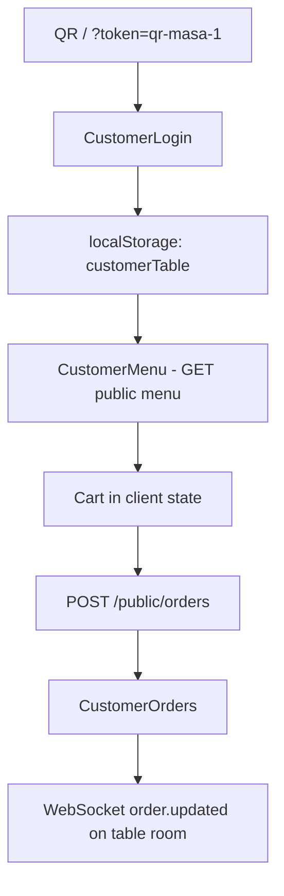
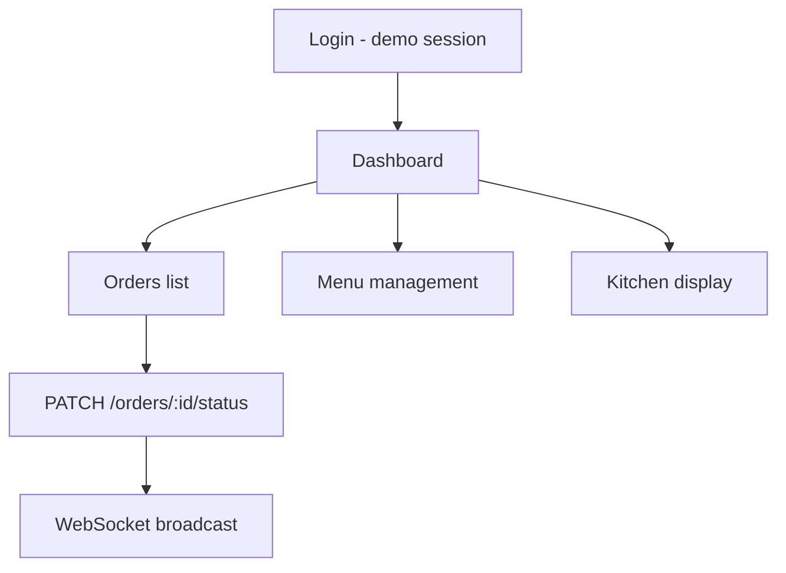
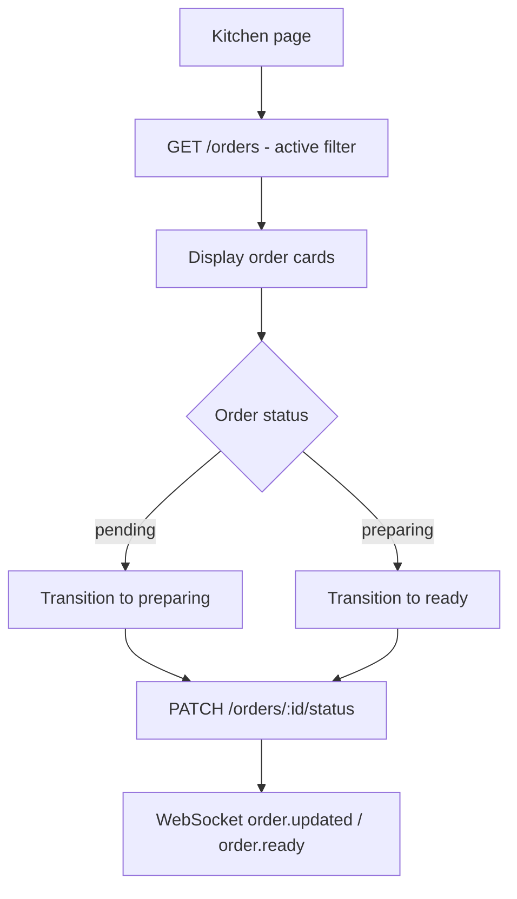
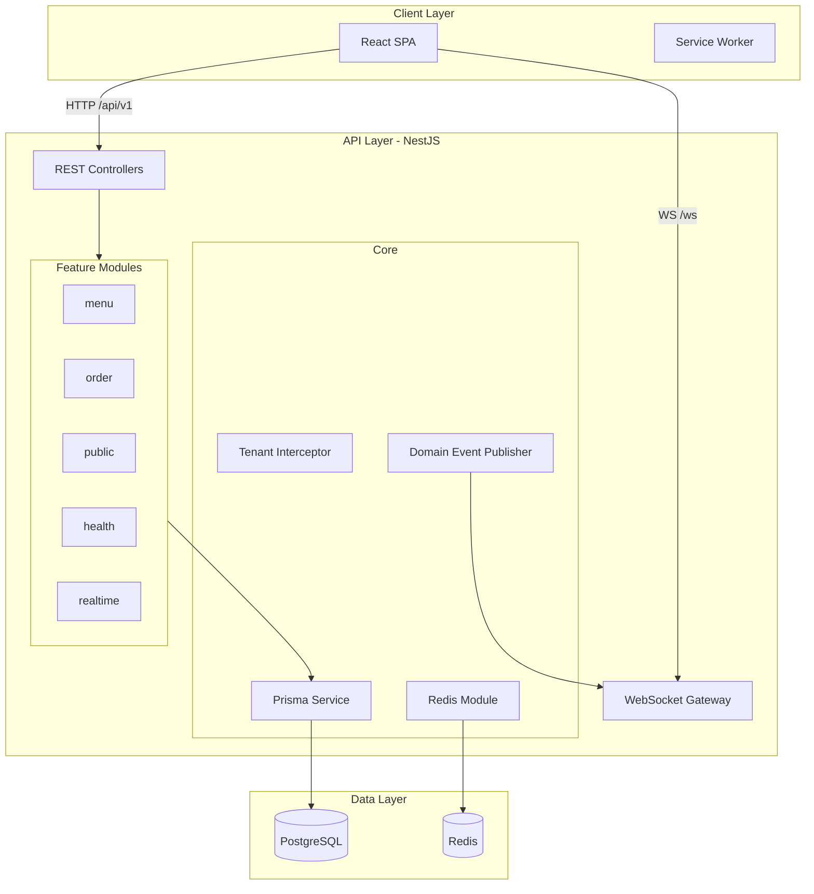
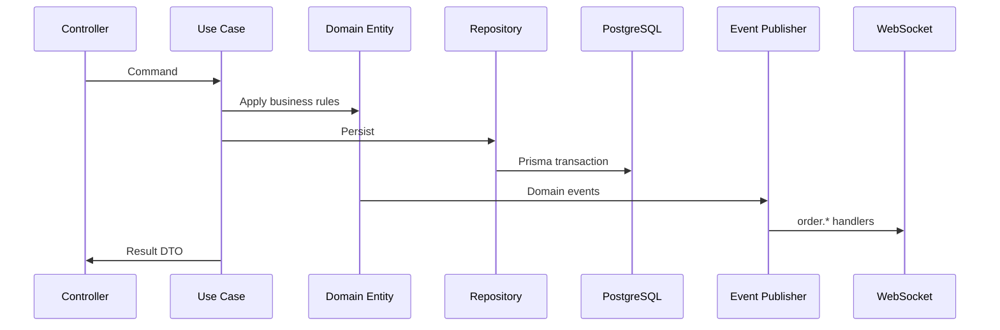
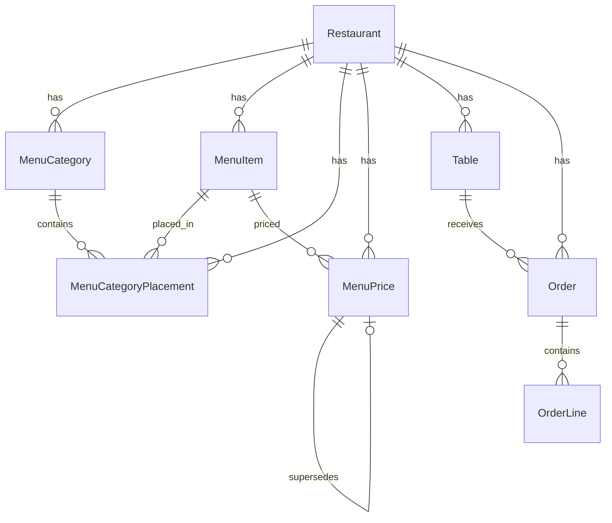
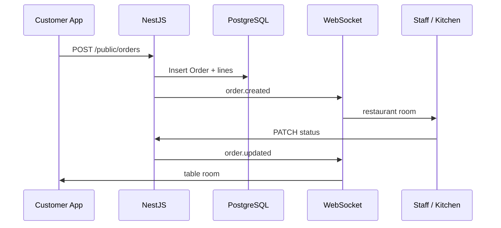

# Akıllı Garson — Project Technical Report

**Product:** Akıllı Garson (Smart Waiter)  
**Version:** 2.0.0 (Release Candidate 1)  
**Document date:** July 2026  
**Status:** Demo Edition — core flows operational on NestJS + PostgreSQL

---

## Document scope

This report describes the **current implementation** of Akıllı Garson: product intent, architecture, data model, APIs, frontend structure, realtime behavior, deployment, limitations, and roadmap. It is intended as reference documentation for engineers reviewing the repository.

Related documents:

| Document | Purpose |
|----------|---------|
| [EXECUTIVE_SUMMARY.md](./EXECUTIVE_SUMMARY.md) | Short overview (2–3 pages) |
| [README.md](../README.md) | Setup and quick start |
| [MIMARI-TASARIM.md](./MIMARI-TASARIM.md) | Architecture design (Turkish) |
| [IS-KURALLARI.md](./IS-KURALLARI.md) | Domain business rules |
| [YOL-HARITASI.md](./YOL-HARITASI.md) | Product roadmap |

---

## 1. Product definition

### 1.1 Description

Akıllı Garson is a restaurant operations platform supporting:

- **QR-based customer menu and ordering** (dine-in)
- **Staff order management** and status workflow
- **Kitchen display** (order-level status)
- **Menu administration** (categories, items, prices)
- **Operational dashboard** (client-side aggregation from orders)
- **Realtime notifications** via WebSocket

### 1.2 Technology stack

| Layer | Technology | Version |
|-------|------------|---------|
| UI | React | 18.3 |
| Build | Vite | 6.x |
| Routing | React Router | 7.x |
| Server state | TanStack Query | 5.x |
| Client state | Zustand | 5.x |
| HTTP client | Axios | 1.x |
| API | NestJS | 11 |
| ORM | Prisma | 6 |
| Database | PostgreSQL | 16 |
| Cache / queue infra | Redis, BullMQ | 7 (module registered; no job processors) |
| Realtime | `ws` + NestJS gateway | — |
| API docs | Swagger (OpenAPI) | `/docs` |

### 1.3 Release classification

| Classification | Description |
|----------------|-------------|
| **Implemented** | Public QR menu/order, staff menu CRUD (partial), orders list/status, kitchen view, WebSocket order events, health checks, demo seed |
| **Partial** | Staff auth (client demo session), RBAC (frontend only), i18n, PWA service worker shell |
| **Not implemented** | JWT auth, tables/payments/reservations/inventory APIs, CI/CD, production containers, E2E test suite |

### 1.4 User roles

| Role | Interface | Access |
|------|-----------|--------|
| Customer (dine-in) | `/customer/*` | Public menu and order APIs |
| Waiter / kitchen / manager | Staff SPA under `AuthGuard` | Orders, kitchen, menu, dashboard, settings |
| System operator | API / Swagger | Health, documented REST endpoints |

---

## 2. Business context

### 2.1 Operational problems addressed

| Problem | System response |
|---------|-----------------|
| Order intake bottleneck at peak service | Parallel QR ordering per table |
| Disconnected order–kitchen–service state | Central `Order` aggregate with shared status machine |
| Limited operational visibility | Dashboard and order list fed from live API |
| Static paper menus | Digital menu with staff-side price updates |

### 2.2 Implementation status by problem area

| Area | Status |
|------|--------|
| QR self-service ordering | Implemented |
| Order status tracking (staff + customer) | Implemented |
| Kitchen visibility | Implemented at **order** level (not per-line tickets) |
| Realtime notification | WebSocket + optional polling |
| Table management | Schema only; REST API not implemented |
| Payments / POS | Not implemented |
| Reservations | Not implemented |
| Inventory | Not implemented |
| Multi-restaurant SaaS product | Schema and tenant fields present; onboarding and billing not implemented |

### 2.3 Process comparison

```
Traditional:  Customer → Waiter → Paper → Kitchen → Waiter → Cashier
Akıllı Garson: Customer → QR → API → Kitchen display → Staff notification → Cashier (manual / future payment module)
```

---

## 3. Product vision

### 3.1 Direction

The platform is designed to support end-to-end dine-in operations: digital menu, order lifecycle, kitchen coordination, and future payment and reporting modules under a single tenant-scoped codebase.

### 3.2 Multi-tenant model

| Concern | Current | Planned direction |
|---------|---------|-------------------|
| Tenant root | `Restaurant` entity | Unchanged |
| Staff tenant context | `X-Restaurant-Id` header | JWT claim + optional subdomain routing |
| Data isolation | Application-layer filters | Optional PostgreSQL Row-Level Security |
| Onboarding | `npm run seed:demo` script | Self-service registration (roadmap) |
| Billing | Not implemented | Subscription billing integration (roadmap) |

### 3.3 QR ordering

- **Active:** `tableToken` resolves table and restaurant; public menu and order creation endpoints
- **Not implemented:** Integrated payment, multi-language menu content API, allergen filtering

### 3.4 Kitchen display (KDS)

- **Frontend:** Full-screen kitchen UI consuming orders API
- **Backend:** No separate `KitchenTicket` aggregate; kitchen uses `Order` status (`open`, `in_kitchen`, `partially_served`, etc.)
- **Schema placeholders:** `kitchenStationId` on menu and order line snapshots for future station routing

---

## 4. Feature inventory

| Feature | Description | Backend | Frontend (Demo Edition) |
|---------|-------------|---------|-------------------------|
| QR menu | Token-based public menu | ✅ | ✅ Live |
| QR order | Public order creation | ✅ | ✅ Live |
| Customer order history | Filtered by table | ✅ | ✅ Live |
| Staff menu listing | Categories + items | ✅ | ✅ Live |
| Menu item create | POST `/menu/items` | ✅ | ✅ Live |
| Price update | PATCH price | ✅ | ✅ Live |
| Availability toggle | Stock / availability | ❌ | Stub message |
| Item/category archive | Use cases exist | ⚠️ No HTTP route | — |
| Order list | GET `/orders` | ✅ | ✅ Live |
| Order status update | PATCH status | ✅ | ✅ Live |
| Kitchen display | Mapped from orders | ✅ | ✅ Live (order-level actions) |
| Dashboard stats | Client-side from orders | ✅ (data) | ✅ Live |
| WebSocket events | Order created/updated | ✅ | ✅ Live |
| Tables CRUD | — | ❌ | Roadmap page |
| Staff management | — | ❌ | Roadmap page |
| Reservations | — | ❌ | Roadmap page |
| Payments | — | ❌ | Roadmap page |
| Inventory | — | ❌ | Roadmap page |
| Service calls | — | ❌ | Not exposed |
| JWT authentication | — | ❌ | Demo PIN session |
| RBAC | — | ❌ | Frontend `usePermissions` only |
| i18n | Locale files | — | Partial |
| PWA | Service worker | — | Shell only |
| CI/CD | — | ❌ | — |
| Swagger | OpenAPI | ✅ | N/A |

---

## 5. User flows

### 5.1 Customer flow



**Steps:**

1. Customer opens customer route with `tableToken`
2. `GET /api/v1/public/menu/:tableToken` loads menu and table metadata
3. Cart is held in React state; total is sum of line prices (no service-fee calculation in RC1)
4. `POST /api/v1/public/orders` creates order; `tableId` persisted from response
5. Order list filtered client-side; WebSocket invalidates queries on updates

### 5.2 Staff flow



Staff authentication is a **local demo session** (hardcoded waiter records, PIN `1234`). No token is issued by the API.

### 5.3 Kitchen flow



Kitchen UI actions map to **order-level** status transitions. Per-line preparation state is not modeled in the backend.

### 5.4 Cashier / payment flow (current)

Orders can be marked completed via status update. A dedicated payments module and fiscal receipt integration are **not implemented**. Any payment UI on legacy pages routes to roadmap modules or displays unavailable messaging.

### 5.5 Admin / manager flow

Live paths: dashboard, orders, kitchen, menu, system settings, system health. Roadmap sidebar entries (tables, staff, reservations, inventory, payments, reports) render preview pages with module metadata — they do not call backend APIs.

---

## 6. Technical architecture

### 6.1 System diagram



### 6.2 Backend module layout (Menu — reference implementation)

```
menu/
├── domain/          entities, value objects, events, factories
├── application/     commands, queries, use cases, ports
├── infrastructure/  Prisma repositories, mappers, unit of work
└── presentation/    controllers, DTOs, response mappers
```

**Patterns:**

| Pattern | Implementation |
|---------|----------------|
| Repository | Port interfaces → Prisma adapters |
| CQRS | Manual command/query classes; no `@nestjs/cqrs` |
| Domain events | `DomainEventPublisher` + `@nestjs/event-emitter` |
| Unit of Work | `PrismaUnitOfWork` with transaction scope |
| Optimistic locking | `version` field + helper on conflicting updates |

### 6.3 Request flow (write path)



---

## 7. Domain design

### 7.1 Bounded contexts

| Context | Implementation | Module path |
|---------|----------------|-------------|
| Menu | Complete DDD stack | `api/src/modules/menu` |
| Order | Aggregate + status machine | `api/src/modules/order` |
| Public (QR) | Read model + order intake | `api/src/modules/public` |
| Table | Prisma model only | — |
| Payment | Not started | — |
| Reservation | Not started | — |
| Inventory | Not started | — |
| Auth / Identity | Env placeholders only | — |
| Realtime | WebSocket bridge | `api/src/modules/realtime` |

### 7.2 Aggregates

| Aggregate root | Children | Tenant key |
|----------------|----------|------------|
| `Restaurant` | — | — |
| `MenuCategory` | — | `restaurantId` |
| `MenuItem` | `MenuPrice` | `restaurantId` |
| `MenuCategoryPlacement` | N:M link | `restaurantId` |
| `Table` | — | `restaurantId` |
| `Order` | `OrderLine` (snapshot) | `restaurantId` |

### 7.3 Value objects (Menu module)

| Value object | Purpose |
|--------------|---------|
| `Money` | `amountMinor` + `currencyCode` |
| `CategorySlug`, `MenuItemSlug` | URL-safe identifiers |
| `Sku` | Stock-keeping unit rules |
| `CategoryColor`, `DisplayOrder` | Presentation metadata |
| `MenuItemSnapshot` | Captured fields for order lines |

### 7.4 Domain events

| Event | Module |
|-------|--------|
| `menu.category.created`, `menu.category.archived` | Menu |
| `menu.item.created`, `menu.item.activated`, `menu.item.archived` | Menu |
| `menu.price.changed` | Menu |
| `menu.category-placement.*` (4 variants) | Menu |
| `order.created`, `order.opened`, `order.status-changed` | Order |

WebSocket bridge handles `order.created` and `order.status-changed` via `OrderRealtimeHandler`.

### 7.5 Use cases (15)

**Menu (10):** CreateCategory, ArchiveCategory, ListCategories, GetCategory, CreateMenuItem, ArchiveMenuItem, GetMenuItem, ListMenuItems, AttachMenuItemToCategory, ChangeMenuItemPrice

**Order (4):** CreateOrder (public), ChangeOrderStatus, GetOrder, ListOrders

**Public (1):** GetPublicMenu

`ArchiveCategory` and `ArchiveMenuItem` are covered by integration tests but not exposed on HTTP routes in RC1.

---

## 8. Database design

### 8.1 Entity relationship



### 8.2 Models

| Model | Table | Soft delete |
|-------|-------|:-----------:|
| `Restaurant` | `restaurants` | — |
| `Table` | `tables` | `deletedAt` |
| `MenuCategory` | `menu_categories` | `deletedAt` |
| `MenuItem` | `menu_items` | `deletedAt` |
| `MenuCategoryPlacement` | `menu_category_placements` | — |
| `MenuPrice` | `menu_prices` | `deletedAt` |
| `Order` | `orders` | `deletedAt` |
| `OrderLine` | `order_lines` | — |

### 8.3 Constraints and invariants

- All business rows scoped by `restaurantId`
- `OrderLine` has **no FK** to `MenuItem` — snapshot pattern preserves historical price and name
- Uniques include `(restaurantId, slug)`, `(restaurantId, sku)`, `(categoryId, menuItemId)`, `(orderId, lineNumber)`
- `OrderStatus` enum: `draft`, `open`, `in_kitchen`, `partially_served`, `served`, `bill_requested`, `payment_in_progress`, `closed`, `cancelled`, `voided`

### 8.4 Indexing

Approximately 29 indexes. Common patterns:

- Tenant scope: `idx_*_restaurant`
- Soft-delete filters: `idx_*_restaurant_not_deleted`
- Order queries: `idx_orders_restaurant_status`, `idx_orders_restaurant_created`
- Price resolution: `idx_menu_prices_resolve` (branch/channel placeholders)

### 8.5 Multi-tenant resolution

```
Restaurant (tenant root)
    └── restaurantId required on child tables
```

| API surface | Tenant resolution |
|-------------|-------------------|
| Staff REST | `X-Restaurant-Id` header → `TenantInterceptor` → `AsyncLocalStorage` |
| Public REST | `tableToken` → table → `restaurantId` |

Schema placeholders for future models: `branchId`, `salesChannelId`, `taxCategoryId`, `kitchenStationId`.

### 8.6 Migrations

| Migration | Content |
|-----------|---------|
| `20250703090000_init_menu` | Menu schema |
| `20250703100000_add_tables` | `Table` model |
| `20250703110000_add_orders` | `Order`, `OrderLine` |

---

## 9. API reference

### 9.1 Module summary

| Module | Controller | Endpoints |
|--------|------------|----------:|
| Health | `health.controller` | 3 |
| Menu category | `menu-category.controller` | 3 |
| Menu item | `menu-item.controller` | 5 |
| Order (staff) | `order.controller` | 3 |
| Public menu | `public-menu.controller` | 1 |
| Public order | `public-order.controller` | 1 |
| **Total REST** | | **16** |

Swagger UI: `GET /docs` (Bearer and `X-Restaurant-Id` documented; Bearer not enforced in RC1)

### 9.2 Public API (unauthenticated)

| Method | Path | Description |
|--------|------|-------------|
| GET | `/api/v1/public/menu/:tableToken` | Menu for table |
| POST | `/api/v1/public/orders` | Create order (`tableToken`, `lines[]`) |

### 9.3 Staff API (`X-Restaurant-Id` required)

**Menu**

| Method | Path |
|--------|------|
| POST | `/menu/categories` |
| GET | `/menu/categories` |
| GET | `/menu/categories/:id` |
| POST | `/menu/items` |
| GET | `/menu/items` |
| GET | `/menu/items/:id` |
| POST | `/menu/items/:menuItemId/categories` |
| PATCH | `/menu/items/:menuItemId/price` |

**Orders**

| Method | Path |
|--------|------|
| GET | `/orders` |
| GET | `/orders/:id` |
| PATCH | `/orders/:id/status` |

**Health**

| Method | Path |
|--------|------|
| GET | `/health`, `/health/live`, `/health/ready` |

### 9.4 Response envelope

```json
{
  "success": true,
  "data": { },
  "timestamp": "2026-07-03T12:00:00.000Z"
}
```

The frontend Axios interceptor unwraps `data` automatically.

### 9.5 Status mapping (API ↔ UI)

| API (`OrderStatus`) | UI label |
|---------------------|----------|
| `open` | pending |
| `in_kitchen` | preparing |
| `partially_served` | ready |
| `served` | served |
| `closed` | completed |

Mapping is implemented in `src/api/adapters.js`.

---

## 10. Frontend architecture

### 10.1 Directory structure

```
src/
├── api/           axios, adapters, services (API_ENABLED flags)
├── components/    layout, providers, shared UI
├── config/        navigation, modules, features
├── hooks/         TanStack Query hooks
├── pages/         staff and customer routes
├── store/         Zustand (useAppStore)
├── locales/       tr.js, en.js
└── utils/         print, sound helpers
```

### 10.2 TanStack Query

- Global defaults: `staleTime` 5 minutes; query retry 3; mutation retry 0
- Query key factories per domain (`kitchenKeys`, order keys, etc.)
- Roadmap hooks use `API_ENABLED` to avoid calling unimplemented services

### 10.3 Zustand persistence

Persisted: `activeWaiter`, theme, language, sound settings, notification preferences, kitchen refresh interval. Server data remains in Query cache only.

### 10.4 Provider tree

```
ErrorBoundary
└── QueryClientProvider
    └── BrowserRouter
        └── ThemeProvider
            └── WebSocketProvider
                └── NotificationProvider
                    └── App
```

### 10.5 Routing (Demo Edition)

| Route | Component | Status |
|-------|-----------|--------|
| `/login` | Login | Live |
| `/`, `/orders`, `/kitchen`, `/menu` | Core staff | Live |
| `/system/settings`, `/system/health` | Settings, health | Live |
| `/restaurant/*`, `/operations/*`, `/menu/categories` | RoadmapPage | Preview only |
| `/customer`, `/customer/menu`, `/customer/orders` | Customer flow | Live |

All page components are lazy-loaded with `React.Suspense`.

### 10.6 Adapter layer

`adapters.js` responsibilities:

- Money: minor units (kuruş) ↔ major units (TRY)
- Order status enum translation
- Menu item availability from `MenuItemStatus`
- Category and public menu mapping

---

## 11. Realtime architecture

### 11.1 Connection

| Setting | Value |
|---------|-------|
| URL | `ws://localhost:3001/ws` (`VITE_WS_URL`) |
| Gateway | `RealtimeGateway` (NestJS) |
| CORS | Permissive in development |

### 11.2 Client → server

| Event | Payload | Purpose |
|-------|---------|---------|
| `join` | `{ role, restaurantId?, tableToken?, tableId? }` | Join room |
| `connected` | — | Acknowledgement |

### 11.3 Server → client (orders)

| Event | Trigger |
|-------|---------|
| `order.created` | Order created |
| `order.updated` | Status change |
| `order.ready` | Status → `PARTIALLY_SERVED` |
| `order.served` | Status → `SERVED` |

Payload envelope: `{ type, payload, timestamp, restaurantId }`

### 11.4 Rooms

| Room | Members |
|------|---------|
| `restaurant:{restaurantId}` | Staff (`role: staff`) |
| `table:{tableId}` | Customer (`role: customer`) |

### 11.5 Sequence (order creation)



`WebSocketProvider` invalidates TanStack Query caches on relevant events.

---

## 12. Security

| Topic | Status | Notes |
|-------|--------|-------|
| JWT authentication | Not implemented | Env placeholders only |
| RBAC | Frontend only | `usePermissions.js`; no API guards |
| Tenant isolation | Partial | `X-Restaurant-Id` header; not signed |
| Public API | Open with token | Knowledge of `tableToken` allows ordering |
| Input validation | Implemented | `class-validator`, global `ValidationPipe` |
| HTTP headers | Implemented | Helmet, compression, CORS |
| Rate limiting | Not implemented | — |
| HTTPS | Development HTTP | Required for production deployment |
| Secrets | `.env` (gitignored) | Examples in `.env.example` |
| SQL injection | Mitigated | Prisma parameterized queries |

**Production blockers:** authenticated staff sessions, signed tenant context, rate limits on public endpoints, secrets management, and security review of customer-facing routes.

---

## 13. Performance characteristics

| Mechanism | Status |
|-----------|--------|
| Optimistic locking (`version`) | Implemented |
| Database transactions (`PrismaUnitOfWork`) | Implemented |
| Route-level code splitting | Implemented |
| Query `staleTime` tuning | Global 5 min; orders ~10 s |
| Redis caching for menu/orders | Module present; not applied to reads |
| Kitchen polling | Optional 5 s interval (configurable in store) |
| Menu list N+1 pattern | Staff menu may request per category |
| Main bundle size | ~462 KB (~152 KB gzip) — includes Recharts |

---

## 14. Testing

| Type | Status |
|------|--------|
| Backend unit tests | None |
| Backend integration | `create-category.integration.spec.ts` — 10 cases (menu) |
| Integration infrastructure | Testcontainers PostgreSQL or local DB |
| Frontend unit tests | None |
| E2E | Playwright dependency present; no committed test suite |
| Coverage config | Menu integration coverage script available |

**Gaps:** order flow integration tests, public API contract tests, WebSocket integration tests, frontend regression automation.

---

## 15. Deployment and operations

### 15.1 Local development

| Step | Command |
|------|---------|
| Infrastructure | `cd api/docker && docker compose up -d` |
| API dependencies | `cd api && npm install` |
| Migrations | `cd api && npx prisma migrate deploy` |
| Demo data | `cd api && npm run seed:demo` |
| API server | `cd api && npm run start:dev` |
| Frontend | `npm install && npm run dev` |

### 15.2 Services and ports

| Service | Port |
|---------|------|
| API | 3001 |
| Frontend (Vite) | 5173 |
| PostgreSQL | 5432 |
| Redis | 6379 |

### 15.3 DevOps inventory

| Item | Status |
|------|--------|
| Docker Compose (Postgres + Redis) | Available |
| API Dockerfile | Not provided |
| Frontend container | Not provided |
| CI/CD (GitHub Actions) | Not configured |
| Structured logging | Pino (NestJS) |
| Health endpoints | `/health/live`, `/health/ready` (Prisma + Redis) |
| BullMQ workers | Registered; no processors |
| Windows helpers | `api/scripts/dev-db.mjs`, VBS launchers for embedded PostgreSQL |

### 15.4 Environment variables

**Frontend (`/.env`)**

| Variable | Purpose |
|----------|---------|
| `VITE_API_URL` | REST base URL |
| `VITE_RESTAURANT_ID` | Staff tenant header |
| `VITE_WS_URL` | WebSocket URL |

**Backend (`/api/.env`)**

| Variable | Purpose |
|----------|---------|
| `DATABASE_URL` | PostgreSQL connection |
| `REDIS_HOST`, `REDIS_PORT` | Redis |
| `PORT`, `API_PREFIX` | Server binding |
| `CORS_ORIGIN` | Allowed frontend origin |
| `JWT_*` | Placeholders for future auth module |

### 15.5 Demo credentials and data

| Item | Value |
|------|-------|
| Restaurant ID | `660e8400-e29b-41d4-a716-446655440001` |
| Table tokens | `qr-masa-1` … `qr-masa-4` |
| Staff login (demo) | `ahmet@restoran.com` / PIN `1234` |
| Customer URL | `http://localhost:5173/customer?token=qr-masa-1` |

---

## 16. Current implementation status

### 16.1 Completed

- NestJS modular monolith with five feature modules
- Menu bounded context (full DDD layers)
- Order bounded context (create, status transitions, snapshots)
- Public QR menu and order endpoints
- Prisma schema with tenant fields and three migrations
- WebSocket order notifications
- Swagger documentation
- React staff and customer applications (Demo Edition)
- Frontend API adapter layer and feature flags
- Menu category integration test suite
- Idempotent demo seed script (`seed:demo`)
- Domain events and optimistic locking on key writes

### 16.2 In progress / partial

- Roadmap module UX (sidebar preview pages)
- Realtime-driven UI refresh (WebSocket + query invalidation)
- Internationalization (locale files; incomplete coverage)
- PWA service worker (basic asset cache)

### 16.3 Not started

- Backend authentication and authorization
- Tables, payments, reservations, inventory, service-calls REST APIs
- HTTP routes for menu archive use cases
- Order line add/remove API
- CI/CD pipeline and container images
- Production hosting and observability stack
- E2E automated tests

### 16.4 Technical debt (documented)

| Item | Impact |
|------|--------|
| Client-only staff auth | Blocks production multi-user deployment |
| Roadmap UI surface area | Navigation includes non-functional modules (labeled) |
| Frontend JavaScript (no TypeScript) | Weaker API contract enforcement |
| Manual CQRS convention | Consistency depends on module discipline |
| Menu fetch pattern | Potential redundant HTTP requests per category |
| Low automated test coverage | Regression risk on changes |

---

## 17. Roadmap

### Near term (approximately 1 month)

- Tables REST API and frontend enablement
- JWT authentication with role claims
- Order module integration tests
- CI: lint, build, integration tests
- Menu archive and availability HTTP endpoints

### Mid term (approximately 3 months)

- Payments module (cash and card recording)
- Service calls (waiter request from customer UI)
- E2E flow: QR → order → kitchen → complete
- API Docker image and staging environment
- Complete i18n coverage

### Long term (6–12 months)

- Multi-restaurant onboarding flow
- Branch and sales-channel pricing (`MenuPrice` context fields)
- Kitchen station routing
- Analytics aggregation module
- Rate limiting, audit logging
- Subscription billing integration
- Optional PostgreSQL Row-Level Security for tenants

Full roadmap: [YOL-HARITASI.md](./YOL-HARITASI.md)

---

## 18. Repository statistics (reference)

| Area | Count |
|------|------:|
| Backend TypeScript files (`api/src`) | ~178 |
| Menu module files | ~93 |
| Frontend pages | 16 route components |
| Frontend hooks | 19 |
| Use cases | 15 |
| Domain events | 13 |
| REST endpoints | 16 |
| Prisma models | 8 |
| Migrations | 3 |
| Menu integration tests | 10 |

---

## 19. Related documentation

| Document | Content |
|----------|---------|
| [EXECUTIVE_SUMMARY.md](./EXECUTIVE_SUMMARY.md) | Condensed overview |
| [BACKEND-ISKELET.md](./BACKEND-ISKELET.md) | NestJS skeleton conventions |
| [MENU-DOMAIN-TASARIMI.md](./MENU-DOMAIN-TASARIMI.md) | Menu domain design |
| [RC1_P0_COMPLETION_REPORT.md](./RC1_P0_COMPLETION_REPORT.md) | RC1 credibility fixes |
| [docs/archive/](./archive/README.md) | Historical reports (pre-NestJS era) |

---

*This document reflects the repository state at Release Candidate 1. For setup instructions, see the root [README.md](../README.md).*
